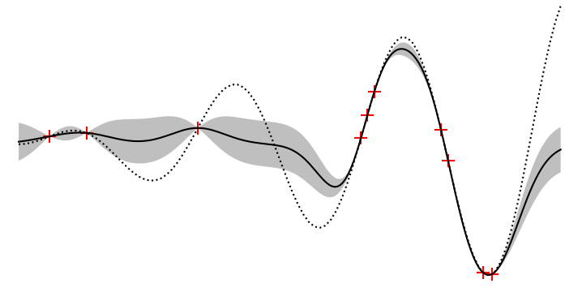

# carly

A Python implementation of the Gaussian Processes framework with Bayesian Optimization.
Fit noiseless or noisy data and use existing or custom kernels.
Bayesian optimization module using existing acquisition functions (μ+kσ, PI) or custom.

# Dependencies

* numpy

# Installation

pip install gaupro
